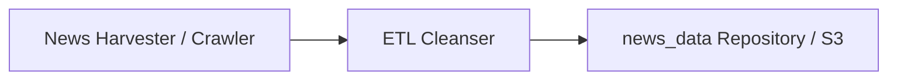
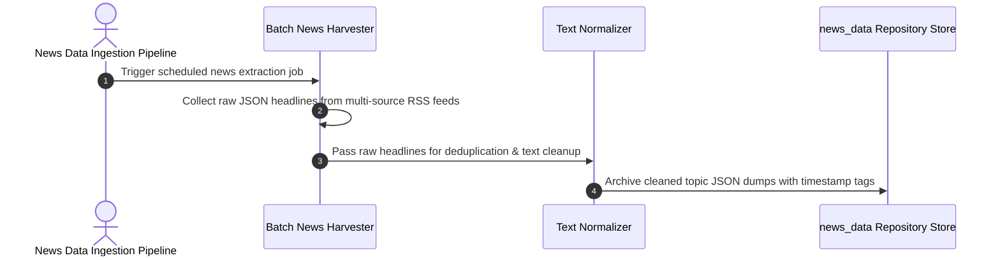

# NewsHub Data Store — Data Pipeline & Ingestion Store
[]()
[]()
[]()
[]()

## Overview
A foundational repository designated for NewsHub historical dataset archives, ETL data extraction scripts, and cached topic ingestion models.

- **Problem Solved:** Structured historical data storage and batch ingestion for news aggregators.
- **Target Users:** Data engineers and backend architects.
- **Current Status:** Foundation Template / Data Store.

## Features
- **Structured Directory Scaffold:** Ready for batch ingestion logs and JSON news dumps.
- **Clean Configuration:** Standardized ignore definitions for data dumps.

## Architecture


## User Flow


## Technology Stack
| Layer | Technology | Purpose |
|---|---|---|
| Platform | Git & Cloud Storage | Data catalog versioning |

## Infrastructure
*Local or cloud data storage.*

## Project Structure
```text
news_data/
├── .gitignore           # Git ignore definitions
└── README.md            # Technical documentation
```

## Prerequisites
- Python 3.10+ or Node.js 18+

## Environment Variables
*Not required.*

## Local Development Setup
```bash
git clone https://github.com/Bhanutejanallamothu/news_data.git
cd news_data
```

## Docker Setup
*Not applicable.*

## Database Setup
*Not applicable.*

## API Documentation
*Not applicable.*

## Deployment
Store data artifacts.

## Security
- Ensure no confidential or PII data dumps are committed to public storage.

## Testing
*Not applicable.*

## Troubleshooting
*None.*

## Future Improvements
- Automated daily news headline archiver script.

## License
All rights reserved by repository owner.
